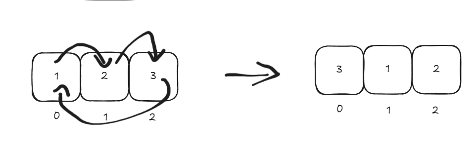
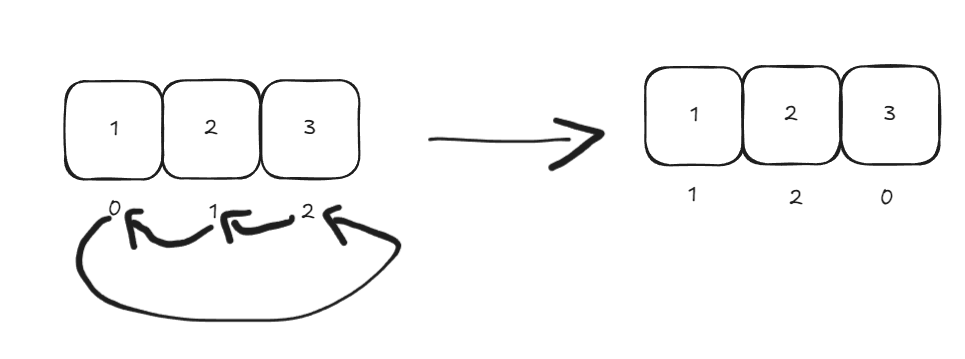

```cpp
int x = query - k;
result = arr[((x % n) + n) % n];
```
For each query `query`, we can find the element at the position after shifting the elements by shifting the index we seek itself. 
Assume k = 1, that is we have to shift the elements ahead by 1. And n=3, that is there are 3 elements, index 0,1 and 2.
- There's two ways we can represent shifting elements ahead in an array, first is that we move the elements theirselves, that is, value shifting, 


In this case the values are shifted by 1, this operation will take O(n) and then we can directly get result=arr[query].
- Another way of representing shifting the elements, is shifting the positions instead, and we can observe that the positions go in the opposite direction of the element shifting,

Which is equivalent to

We can see that the values are at the same index after shifting either the value or position. And we can understand why, moving the values ahead is equivalent to pulling the positons back, either the car moves forward or the ground moves backward, the car reaches the destination.
 
Meaning if we shift the index itself we can get the value we would get after shifting the values instead, and we do this by shifting the index backwards modulo n, we do modulo because `x%n` means x in the range of n, so if we have 2%3 we get 2, because its in the range of 3, 5%3 gives us 2, meaning we get 5 in the range of 3, its like making 3 sized blocks of integers, and finding where 5 is within a block, it will be at position 2. (Note: `x%n` has 3 unique values, 0 to 2, inclusive, 3%3 will give us 0 again.)
We shift back by k steps, so `query-k`, so if k is 1 and query is 2, we get 1 as our position after the elements are shifted ahead by 1 or positions are shifted back by 1, and 1 is where the element is in the current array.
However, there's a little catch, our values can go negative, `x%n` would work well for positive integers, but for negative integers, such as if query is 0 and k is 1, we should get 2 to represent a shifted array, but we get `x= query-k` is `-1` and `-1%3` is still `-1` which is not what we want, we need integers in the range 0 to 2. We can see -1 does represent the position n-1, or rather (+n)+(-1), which is like saying 1 from the end and languages like python does support it directly too, but we need a general formula to put it in the right range because if the value is 2 and we do `n+2` we would get something out of range. To do so we use the formula $$((x\mod n) +n) \mod n$$, we are simply doing x mod n, so if value is bigger than n, like `5` or `-5` we get it in the range `3`, then add it to n to make it positive, then finally mod n it again to bring it back in the range if it exceeds it, for ex. if x is -1, we do `-1 mod 3` to get `-1`, then add it to n to get `-1+3` to get `2` and mod it again to put it in the range of n. If x was 5, then x%n would give us 2, and 2+n will give us 5, that's why we need the last mod to make sure value shifted to positive is still in the range.
Finally we get the formula as given initially,
`adjusted position = result = arr[((x % n) + n) % n];`


