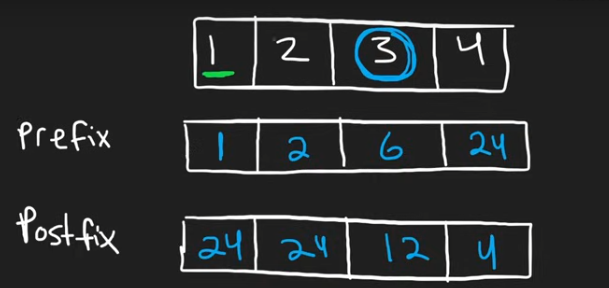

```cpp
void compute() {
  int prefix{1};
  int postfix{1};
  result = vi(n, 1);

  for (size_t i{0}; i < n; ++i) {
    result[i] = prefix;
    prefix = arr[i] * prefix;
  }

  for (size_t i{n - 1}; i >= 0 && i < n; --i) {
    result[i] *= postfix;
    postfix = arr[i] * postfix;
  }
}
```
Problem is for each value n[i], find the product of all values except n[i] and store in output[i]. Constraints are n >=2 and n<=1000, and n[i] in between -20 and 20.
- 1 solution is to simply multiply all elements and store in `value`, then make result of size n and for each result[i], the value is value/arr[i]. TC is O(n) in worst case, also in normal case.
  To avoid division:
- A solution is to convert the array into an unordered map and simply go through all elements except one key, TC is O(n) in average case and O(n^2) in worst. Can be simple O(n*k) where k is a fixed constant sized array, which would be 40 in this case, so we simply use a fixed size array, store bool for every value, and then go through its entirety for each value of n[i]. 
- There's another pretty solution, this one teaches about prefix and postfix sum. TC is O(n). The logic is simple, we can observe that for each element n[i], there's a range of values to its left, and a range of values to its right, if we preprocess the left range and get its multiple, and preprocess its right range and get its multiple, and multiply the 2 we have our answer for output[i]. If we do these 2 steps for all the elements, then we will be able to simply multiply the last element of both ranges until and from (but except) n[i].
That is we do something like this,

To make the implementation simpler, we go from left, n[0] to n[n-1] and prefix[i] = Product of elements from n[0] to n[i] (excluding), which basically just means, we keep multiplying the last value until n[i] and store the combined product in prefix[i]. So we have a `value`, it is 1 (default, because 1 * anything is 1 itself, 0 would change it), now we go prefix[0] which will be value (its really value * last element but there's none so just value which we already started as 1), then we make value *= n[0] as we multiply this element for the next element's prefix product, then we go prefix[1] and this will be same, value, and so on.

And for postfix[i], we go from n[n-1] to n[0], and do the opposite, so postfix[i] = Product of elements from n[n-1] to n[i] (excluding). And the rest is the same.

Now for result[i], we can simply do `prefix[i-1]*postfix[i+1]` and we have our answer, and we can see why it works, the left range has all the elements prodcuted up till i from the start and the right range has the same from the end.

TC is O(n) and SC is O(n) too.

But there's an even cleverer solution, and that makes SC as O(1), that is we do prefix and postfix and store the result in the output array itself. The way this works is the same way we did our prefix and postfix arrays, we first store prefix in all elements of result. Then, we go from the right and result[i] will be result[i] *= value, where value is the postfix product we have been producting all the way from the right. This way we avoid making auxiliary arrays and are done with just one of them.
